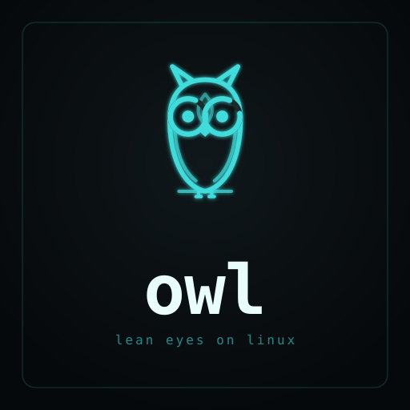

# owl - Linux terminal based machine cleaner




**owl · lean eyes on Linux · system monitor**

A terminal monitor and cleaner for Linux, written in Rust. Real-time system
stats in a clean TUI, plus an interactive app manager, downloads browser, and
cache cleaner. The monitor reads directly from `/proc` and `/sys`; the cleaner
integrates with the system package manager for app removal.

---

## Overview

owl has two layers. The **monitor** (Overview) reads exclusively from the kernel —
no calls to external tools like `sensors`, `lsblk`, or `ip`. Every metric comes
directly from a `/proc` or `/sys` file, parsed by hand in Rust.

The **cleaner** (Apps, Downloads, Clean) adds interactive management: browse and
remove installed applications via the system package manager, delete files from
`~/Downloads`, and reclaim disk space from system and dev tool caches. The
cleaner calls the package manager only when needed; the monitor itself never
invokes external commands.

---

## Views

owl launches to a menu with five views selectable by number or `↑↓ Enter`.

### Overview — system monitor

```
┌owl · lean eyes on Linux ───────────────────────────────────────────────────┐
│▟▙ owl  v0.1   arch   up 3d 04:12   load 0.42 0.55 0.61           14:22:07 │
├──────────────────────────────────────────┬─────────────────────────────────┤
│ CPU  Ryzen 7 5800U                  74% │ MEM                              │
│  c0 ████████░░░░ 22%  c4 ████░░░░░░ 61% │  ram  ████████████████░░░░░  9.4G│
│  c1 ██░░░░░░░░░░ 14%  c5 █████░░░░░ 44% │  swp  ███░░░░░░░░░░░░░░░░░░  0.6G│
│  c2 ██████░░░░░░ 52%  c6 ███████████ 88%│                                  │
│  c3 █░░░░░░░░░░░ 11%  c7 ███████░░░░ 58%│ DISK                             │
│                                         │  /      █████████░░░░░░ 63%      │
│  load 60s  ▁▂▃▄▅▇▆▅▄▃▂▃▄▆▇█▇▆▄▃▂▁      │  /home  ████████████░░░ 81%      │
├──────────────────────────────────────────┼─────────────────────────────────┤
│ NET  wlan0                              │ TEMP                             │
│  rx ↓ 2.4 MB/s  ▂▃▄▆▇▆▅▆▇█▇▆▅▃          │  cpu  64°C ██████████░░░░░░      │
│  tx ↑ 0.8 MB/s  ▁▂▂▃▂▁▂▃▄▃▂▁▂▁          │  ssd  41°C ██████░░░░░░░░░░      │
├──────────────────────────────────────────┴─────────────────────────────────┤
│ BAT  ████████████████░░░░░░░░  73% ↓         HEALTH  ● 92  good            │
└────────────────────────────────────────────────────────────────────────────┘
  q quit   ↑↓ select   tab cycle panel   p pause
```

### Apps — installed application manager

Scrollable list of every installed application discovered from `.desktop` files
(system packages, Flatpak, Snap). Each entry is tagged by source. Press `/` to
filter by name, `d` or `Enter` to queue removal, `y` to confirm. Removal runs
the appropriate package manager command (`pacman -Rns`, `apt remove`, `flatpak
uninstall`, `snap remove`).

### Downloads — file browser

Size-sorted view of `~/Downloads`. Press `/` to filter, `d` or `Enter` to queue
deletion, `y` to confirm. Deletion is guarded — owl refuses to delete anything
outside `~/Downloads`.

### Clean — cache cleaner

Scans for reclaimable disk space and shows each target with its current size.
Targets are detected at runtime — only entries that exist and are non-empty
appear. Covers: thumbnail cache, pip, npm, Cargo registry download cache,
Gradle, Maven, user systemd journal, and pacman cache (requires `paccache`).
Press `d` or `Enter` to queue a target, `y` to confirm. Shell-based targets
(journal vacuum, pacman) drop out of the TUI, run the command, then return.

### Help — keybinding reference

Full keybinding reference for all views.

---

## Features

### Overview panels

| Panel | Data source | What you see |
|-------|-------------|--------------|
| **HEADER** | `/etc/hostname`, `/proc/uptime`, `/proc/loadavg`, `/proc/cpuinfo` | Hostname, uptime, 1m/5m/15m load averages, live clock |
| **CPU** | `/proc/stat` | Per-core % bars (2-column, up to 8 cores), aggregate %, 60s load sparkline |
| **MEM** | `/proc/meminfo` | RAM used/total, swap used/total, threshold-colored bars |
| **DISK** | `/proc/mounts` + `statvfs` | Per-mount usage bars, threshold-colored |
| **NET** | `/proc/net/dev` | Interface name, rx/tx bytes per second, 60-sample sparklines |
| **TEMP** | `/sys/class/hwmon` | CPU and SSD temperatures, threshold-colored gauges |
| **BAT** | `/sys/class/power_supply` | Charge %, charging/discharging/full status |
| **HEALTH** | Derived | Composite score (0–100) from CPU, memory, disk, and thermal |

**Color thresholds** apply to all gauges: below 40% blue · 40–69% yellow · 70%+ red.

### Keybinds

**Global**

| Key | Action |
|-----|--------|
| `q` | Quit |
| `Esc` | Return to menu |
| `↑` / `k` | Move up |
| `↓` / `j` | Move down |
| `Enter` | Open selected |
| `1`–`5` | Jump to view by number |

**Overview**

| Key | Action |
|-----|--------|
| `p` | Pause / resume data refresh |

**Apps and Downloads**

| Key | Action |
|-----|--------|
| `/` | Enter search mode |
| `d` / `Enter` | Queue removal / deletion |
| `y` | Confirm removal / deletion |
| `PageUp` / `PageDown` | Scroll 15 rows |

**Clean**

| Key | Action |
|-----|--------|
| `d` / `Enter` | Queue selected cache for cleaning |
| `y` | Confirm clean |

---

## Architecture

Collection and rendering are strictly separated, with state in the middle.

```
/proc · /sys
    │
    ▼
collect/*          ← pure parsers; never touch the terminal
    │  plain structs
    ▼
app.rs             ← owns all state; drives the tick loop
    │  read-only ref
    ▼
ui/*               ← pure render functions; never read /proc
    │
    ▼
ratatui frame
```

Monitor collectors (`cpu`, `memory`, `disk`, `network`, `thermal`, `power`,
`system`) take a `&str` of file content and return a plain struct — testable
against canned fixtures with no live system required. The thin `read()` wrapper
that reads the actual file is separate.

Cleaner collectors (`apps`, `downloads`, `caches`) read the filesystem directly:
`apps` scans `.desktop` directories and optionally shells out to the package
manager to resolve ownership; `downloads` lists `~/Downloads` by size; `caches`
walks known cache directories and records their sizes for the Clean view.

**Source layout**

```
src/
├── main.rs
├── app.rs           # App state, tick loop, key handling
├── splash.rs        # Launch wordmark
├── collect/
│   ├── cpu.rs       # /proc/stat — delta-based usage
│   ├── memory.rs    # /proc/meminfo
│   ├── disk.rs      # /proc/mounts + statvfs + /proc/diskstats I/O rates
│   ├── network.rs   # /proc/net/dev — delta-based rates
│   ├── thermal.rs   # /sys/class/hwmon — sensor priority ranking
│   ├── power.rs     # /sys/class/power_supply
│   ├── system.rs    # hostname, uptime, load averages, clock
│   ├── apps.rs      # installed app list from .desktop files (system/Flatpak/Snap)
│   ├── downloads.rs # ~/Downloads directory scan, sorted by size
│   └── caches.rs    # cache directory scanner for the Clean view
└── ui/
    ├── mod.rs        # layout engine
    └── widgets.rs    # one render fn per panel
```

---

## Roadmap

### Phase 1 — Monitor (current, v0.1)

The read-only dashboard described above. Every metric comes directly from the
kernel. No writes, no deletions, nothing destructive.

**Upcoming in Phase 1:**

- Panel focus with `↑↓` / `tab` — highlight selected panel
- Process list (top N by CPU/memory, sortable)
- GPU metrics via `/sys/class/drm` and `hwmon` where available
- Per-core frequency from `/sys/devices/system/cpu/cpu*/cpufreq/scaling_cur_freq`
- Battery time-remaining estimate from energy drain rate
- Configurable refresh rate via `--interval`
- Mouse support for panel selection

---

### Phase 2 — Cleaning (planned, v0.5+)

owl will grow a second mode: **interactive disk cleaning**. The same terminal,
the same zero-dependency philosophy — but now with the ability to reclaim space
from caches, orphaned packages, and leftover config directories.

The cleaning phase is designed with a strict safety contract:

1. **Dry-run by default.** `--execute` is an explicit opt-in per invocation.
   The tool never deletes anything without being told to.
2. **Scan → manifest → confirm → execute.** No fused "auto-clean" flow.
   You see exactly what will be removed and how much space it reclaims before
   anything happens.
3. **Protected-path predicate.** `/`, `/etc`, `/usr`, `/var`, `/boot`, `/proc`,
   `/sys`, and anything outside a narrow allowlist are hard-blocked. Symlinks
   and `..` traversal are canonicalized before every check.
4. **Append-only audit log** at `~/.local/state/owl/audit.log`. Every action
   is recorded.
5. **No sudo.** If a target needs root, owl prints the command for you to run.

**Planned cleaning targets (in order of safety):**

| Milestone | Target | Notes |
|-----------|--------|-------|
| v0.4 | App manager + downloads browser | Apps view (searchable list, removal via pacman/apt/dnf/zypper/flatpak/snap), Downloads view (size-sorted browser, guarded deletion) — **done** |
| v0.7 | Cache cleaner | Clean view: thumbnail cache, journald vacuum, pacman `paccache`, dev tool download caches (`~/.npm/_cacache`, `~/.cargo/registry/`, `~/.gradle/caches`, `~/.m2/repository`, `~/.cache/pip`) — **done** |
| v0.5 | Safety primitives | Dry-run mode, audit log — canonicalized path guard on Downloads deletion is live |
| v0.6 | Read-only scanner | Walks targets, produces manifest with size preview; cannot delete |
| v0.8 | Orphan packages + configs | `pacman -Qtdq` orphans; `~/.config/<app>` / `~/.local/share/<app>` where app is gone |
| v0.9 | Docker prune | `docker system prune` with size preview; gated on Docker presence |
| v0.10 | User deny-list | `~/.config/owl/protect.toml` — paths owl must never touch |

**Explicit non-goals:** page-cache dropping (`echo 3 > /proc/sys/vm/drop_caches`
is a placebo), swappiness tuning, preload daemons, Flatpak/Snap leftover cleaning
(heuristics are unreliable and blast radius is too large), `node_modules/` or any
project-local build artifact (not owl's job), `~/.cargo/bin` or other installed
toolchain binaries.

---

## Install & Run

**From source (requires Rust stable):**

```sh
git clone <repo>
cd owl
cargo run --release        # launch directly
cargo install --path .     # install as `owl` on your PATH
```

**Run from anywhere after install:**

```sh
owl
```

**Other commands:**

```sh
cargo test                 # run the unit test suite (58 tests, no live system needed)
cargo build --release      # build release binary at target/release/owl
```

---

## Design notes

- **No external dependencies** beyond `ratatui` and `libc` for the monitor.
  The Apps view shells out to the system package manager (pacman, dpkg, rpm)
  only when resolving package ownership for removal — the monitor itself never
  invokes external commands.
- **Testable by design.** All parsers are pure `parse(&str) -> Struct` functions
  exercised against fixture strings. The test suite runs on any machine, even
  one without the monitored hardware.
- **Rate metrics** (CPU %, network throughput, disk I/O) store the previous
  sample in `App` state and compute deltas. Single-read metrics (memory, disk
  usage) are straightforward snapshots.
- **No panics in collectors.** Malformed `/proc` lines are silently skipped.
  Missing hardware (no battery, no hwmon sensors) gracefully hides the
  relevant panel.
- **Deletion guards use canonicalized paths.** Before any file is deleted,
  both the target path and the allowed root (`~/Downloads`) are resolved
  through `fs::canonicalize` — so symlinks and `..` traversal cannot escape
  the guarded directory.
- **Truecolor throughout.** Accent `#3fdcdc` · TX magenta `#e06ce0` · healthy
  green `#5fd38a` · warn yellow `#e6c46b` · critical red `#e0685f`.

---

## License

MIT
