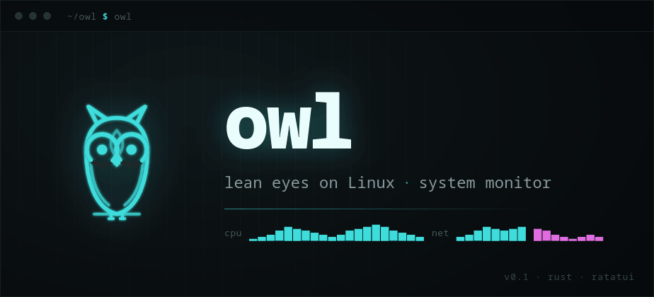
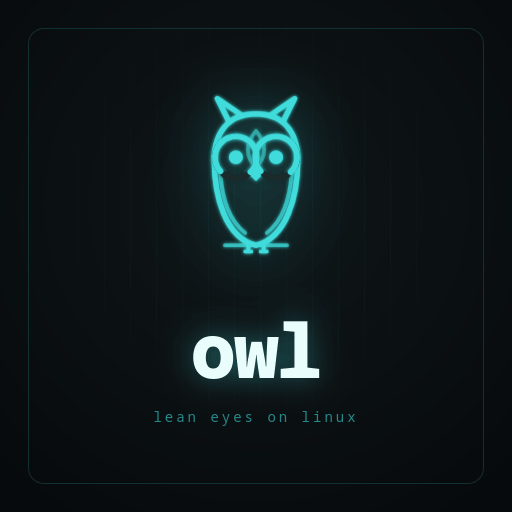

<!--
  Paste this at the top of your project's README.md.
  Make sure the assets/ folder (owl-banner.png, owl-logo.png) sits next to your README,
  or adjust the paths below.
-->

  

  <code>owl</code> · lean eyes on Linux · system monitor 
  A lean terminal system monitor for Linux, written in Rust.

<!-- Square logo variant (repo avatar / sidebar):

  

-->

<!-- Scalable SVG variants (no raster blur):
  assets/owl-mark.svg     — mark only, transparent, font-free (favicon / inline)
  assets/owl-badge.svg    — square dark-tile logo with wordmark
  assets/owl-lockup.svg   — horizontal mark + wordmark + tagline
Example favicon: <link rel="icon" href="assets/owl-mark.svg" type="image/svg+xml" />
-->
